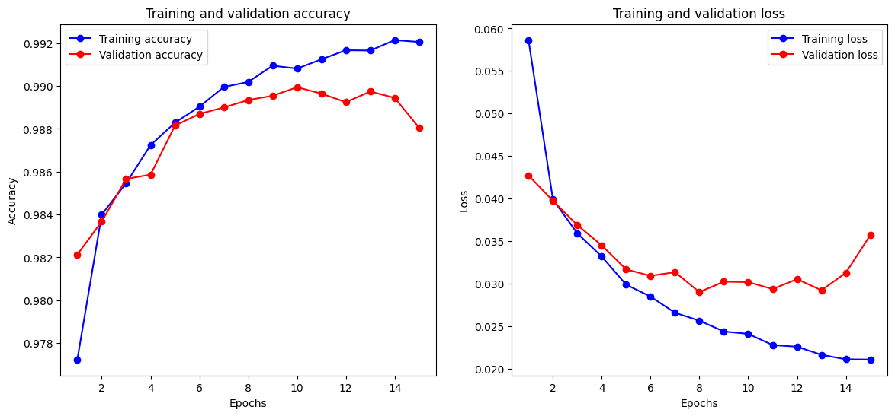

# Credit-Card-Fraud-Detection

## Overview
This project uses machine learning to detect fraudulent credit card transactions. With increasing online transactions, identifying and preventing fraud is crucial for financial security.

## Dataset
The dataset includes credit card transactions made in October 2020, featuring:
- **Type of Card**: MasterCard, Visa
- **Entry Mode**: CVC, PIN, Tap
- **Type of Transaction**: ATM, Online, POS
- **Merchant Group**: Children, Electronics, Entertainment, Fashion, Food, Gaming, Products, Restaurant, Services, Subscription
- **Country of Transaction**: China, India, Russia, USA, United Kingdom
- **Country of Residence**: China, India, Russia, USA, United Kingdom
- **Gender**: F, M
- **Bank**: Barclays, HSBC, Halifax, Lloyds, Metro, Monzo, RBS
- **Shipping Address**: China, India, Russia, USA, United Kingdom

## Methods
We applied several machine learning techniques to detect fraudulent transactions, including:
1. **XGBoost**
   - **Accuracy**: 0.9632
   - **Classification Report**:
     - Precision: 0.97 (Class 0), 0.96 (Class 1)
     - Recall: 0.96 (Class 0), 0.97 (Class 1)
     - F1-Score: 0.96 for both classes

2. **Logistic Regression**
   - **Accuracy**: 0.9836
   - **Classification Report**:
     - Precision: 0.98 (Class 0), 0.99 (Class 1)
     - Recall: 0.99 (Class 0), 0.98 (Class 1)
     - F1-Score: 0.98 for both classes

3. **Feedforward Neural Network (FNN)**
   - **Accuracy**: See attached image for detailed accuracy and loss plots
   

4. **Random Forest**
   - **Accuracy**: 0.9898
   - **Classification Report**:
     - Precision: 0.99 (both classes)
     - Recall: 0.99 (both classes)
     - F1-Score: 0.99 (both classes)

## Performance Metrics
We evaluated the models using various performance metrics to handle the imbalanced nature of the dataset, including::
- Accuracy
- Precision
- Recall
- F1 Score
- AUC-ROC

## Results
The **FNN model** emerged as a powerful tool with an accuracy of 99.2 in combating credit card fraud, setting new benchmarks in accuracy and reliability

## Usage
- To get started with this project follow these Steps:
1. Clone the repository:
   git clone https://github.com/Muhammad-Rizwan12/credit-card-fraud-detection.git
2. Install Dependencies: pip install -r requirements.txt
3. Run the Jupyter Notebook: jupyter notebook Credit-Card-Fraud-Detection.ipynb

## License
This project is licensed under the MIT License - see the LICENSE.md file for details.

## Acknowledgements
- Kaggle for providing the heart disease dataset.
- The open-source community for the tools and libraries used in this project.
